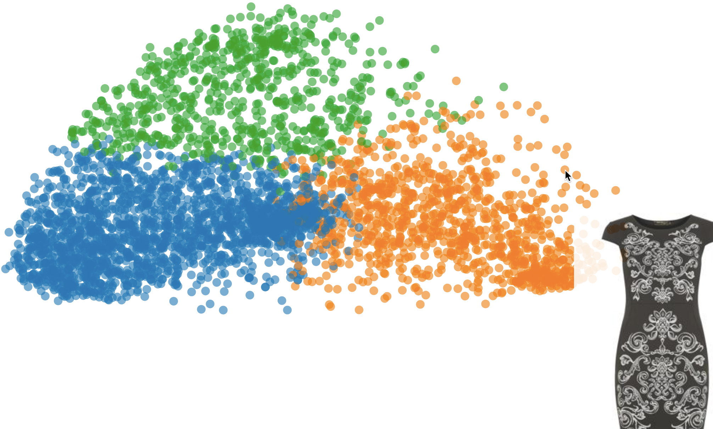
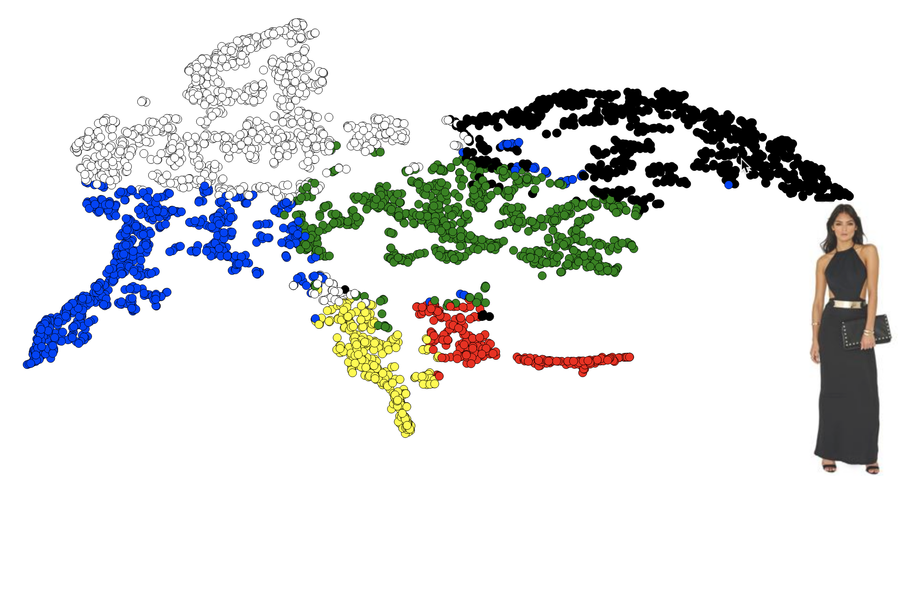
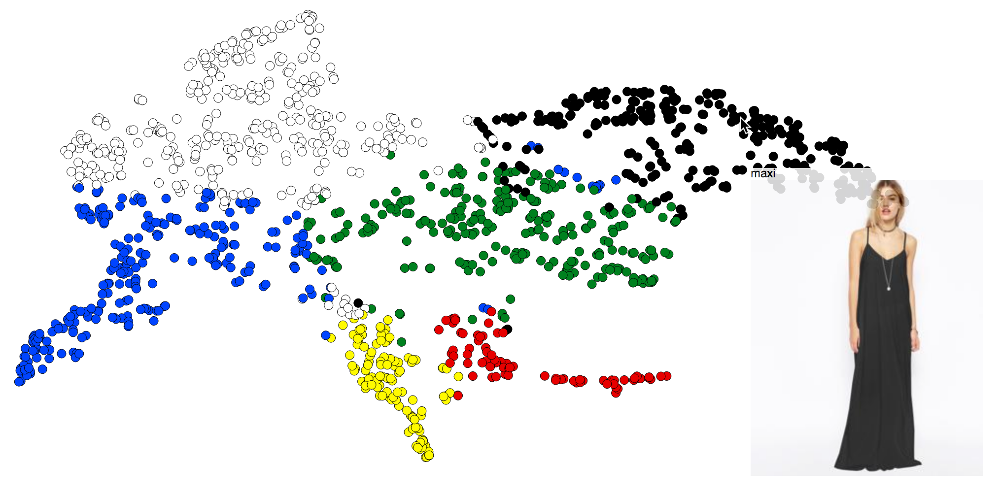

# Clustering images of dresses

I collected ~4000 images of dresses from the _Large-scale Fashion (DeepFashion) Database_ provided by the [Multimedia Laboratory, The Chinese University of Hong Kong](http://mmlab.ie.cuhk.edu.hk/projects/DeepFashion.html).  The images include dresses in various styles, colours and layouts.  Let's play around to find some structure in the data by:

- clustering a histogram of the images' RGB values
- clustering by most dominant colour in the images
- using a CNN to class a dress as _maxi_ or _not maxi_ length

## Clustering by RGB

Firstly, we'll look at clustering the images according to colour. To do this we create a 3-D histogram for each image, binning each of the 3 channels into 8 bins. Helpfully, OpenCV provides a function to do exactly this, so we use this to bin the colours, then we normalise the histogram and flatten the result into a 1-D vector. This reduces the dimensionality of the image to 8<sup>3</sup>=512.

We compute the RGB histogram of each image, and perform K means clustering on the histogram. Having experimented with different numbers of clusters, the data don't seem to be well-separated so we choose a small number of clusters (i.e. 3). We then project the data down into 2-D using PCA, so we can visualise the different clusters.

We can use D3 to provide an [interactive map of these clusters](http://htmlpreview.github.io/?https://github.com/rkhood/dress_clusters/blob/master/cluster_hist.html) (I've just added a static image here). This shows the three clusters (represented by orange, green and blue), where hovering over a data point shows the image of the dress. We can see that though the clustering does a good job of separating out light (hover over blue) and dark (hover over orange), it is unable to distinguish much else and there are some outliers.



## Clustering by most dominant colour

PCA didn't do a great job at separating colours, only broadly distinguishing between light and dark. A better approach is to hard code some colours and cluster images based on the amount of these colours in the images. To do this I'll define some hex colours and helper functions to convert hex to RGB.

I then wrote a function to read in the image, resize it for consistency (200×200×3) and reshape it, so that it is 40,000×3. This produces 40,000 RGB vectors, which we can cluster using `scipy.cluster`. This gives us the colour each pixel is closest to and the distance away from that colour. For example, you can use `dist` to discount pixels that are far away from every cluster. We do a bin count over the codes to see how many pixels fall into each of our set colours. This converts each image into a 6-D colour histogram.

We compute this 6-D colour histogram for every image and divide by the mean number of counts in each bin to control for the background, i.e. a value of more than 1 indicates a more than average amount of this colour present and vice versa. We then use TSNE to embed these 6-D points into a 2-D space where we can visualise them as before (TSNE performed better than PCA in this case).



As before, there is an [interactive map](http://htmlpreview.github.io/?https://github.com/rkhood/dress_clusters/blob/master/cluster_tsne.html), I've also included a static one here. The marker colour is the dominant colour (we define) of that image. This does a much better job at separating by colour. Some main points about our new clusters are:

- Most colours are well-separated
- Interestingly, the green cluster contains many patterned dresses, suggesting the patterns wash out to green
- Points near two clusters are a combination of both colours
- Model attributes, accessories and image text can also affect the clustering. Foreground extraction could help to improve this.


## Using a CNN to find structure

I've separated our dresses data into two classes, _maxi_ and _not maxi_ length, by amalgamating the labels provided by the original dataset.  Dividing into train and test sets, this looks like:

```
data/
├── test
│   ├── maxi
│   └── non_maxi
└── train
    ├── maxi
    └── non_maxi
```

I made a function to use the base part of the VGG16 network without its top to make a 8,192 vector from each image.  Next, we'll build our own small neural network to take these vectors and learn to classify them as maxi or not maxi. We train our small neural net, learning the relationship between the 8,192 vectors from the larger network and the labels. We then score our neural net using the test data. I chose 10 epochs, meaning 10 passes over the data, every training image being passed through the network 10 times because it doesn't seem to learn more after this.

This model works really well! The ROC AUC is 0.97.  I've added this label to the TSNE data set and, as before, I've created an [interactive map](http://htmlpreview.github.io/?https://github.com/rkhood/dress_clusters/blob/master/cnn_rgb_tsne.html), which now has the length of dress written with the image pop-up.  Again, here's a static image.


